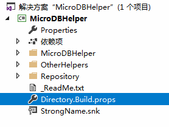
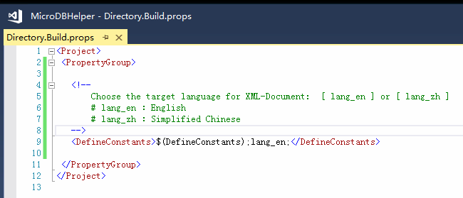

  
# MicroDBHelper
A friendly interface library to use SQLHelper. 

* [main] **friendly interface design** for developers;
* support for **asynchronous programming** (async/await) ;
* lightweight. it's about 25~60kb size of compiled dll. 

Currently it is focus on **MsSql** databases (not support MySql at this moment).  

The MsSqlHepler.cs sourcecode was taken from the **Microsoft .NET Data Access Application Block v2.0** and **improved to** support the latest .net Frameworks and asynchronous programming.    

*Note please:  Asynchronous methods(async/await)  of this library was only supported on .Net framework 4.5 and +.*


## Generated for Framework Version:
* .NET Framework 2.0
* .NET Framework 3.5
* .NET Framework 3.5 Client Profile
* .NET Framework 4.0
* .NET Framework 4.0 Client Profile
* .NET Framework 4.5
* .NET Framework 4.6 
* .NET Standard 2.0

(Since 2018/11/01, this project was began to support "Cross-target multiple target frameworks in one project" features. Which will easy to edit codes and build assemblys with different frameworks, and then developers would enjoy these benefits.)


## Usage

### Initialization
Firstly, set the connection string once, when your assembly is initing.  

``` 
var dbConnection = string.Format("Data Source={0};uid={1};password={2};database={3}", 
                                  DB_IP, 
                                  DB_USER, DB_PSW, 
                                  DB_DATABASE);
MicroDBHelper.SetConnection(dbConnection);
```  

Then the subsequent operations, the library will use the specified connection string for other interfaces.  

(Need to support multiple connection ? Okay,the library support it as well. Search by keywords of "multiple connection support" in this document, then you can get it o(∩_∩)o  ) 


### Query Data
* `MicroDBHelper.ExecuteDataTable` and `MicroDBHelper.ExecuteDataTableAsync`. The former is synchronization operation and the the latter is asynchronous operation. The result is a DataTable.
* `MicroDBHelper.ExecuteScalar` and `MicroDBHelper.ExecuteScalarAsync` will return one Object.
* `MicroDBHelper.ExecuteDataSet` and `MicroDBHelper.ExecuteDataSetAsync` will return one DataSet, which include one or more DataTable(s).

The library offer different overloaded methods for developer to easy pass parameters.Like CommandType(text / storedProcedure), use transaction or not, and so on.


### Execute
* `MicroDBHelper.ExecuteNonQuery` and `MicroDBHelper.ExecuteNonQueryAsync`, execute sql and return the affected rows.

The library offer different overloaded methods for these.


### Transaction 
```
      using (var tran = MicroDBHelper.UseTransaction(!IsolationLevel!)) 
      {
         MicroDBHelper.ExecuteNonQuery(sql_INSERT, paramValues, tran);
         MicroDBHelper.ExecuteNonQuery(sql_UPDATE, paramValues, tran);
         tran.MarkSuccess();
      }
```  

As you see, you need to call `MicroDBHelper.UseTransaction` to get the transaction object, and write your code inside `using` block. Please note, Call the `MarkSuccess()` method at last. 

When the context leave the using block, the transaction will decide to run COMMIT or ROLLBACK automatically:

* when everything is okay and the MarkSuccess() is successfully called, it will commit the result;
* when some exceptions was thrown In this process, it will safely rollback, you can write your try-catch outside the using block, even outside of invoker and don't need to worry about the ROLLBACK and CLOSE of the transaction.


Additionally, the MicroDBTransaction in addition to maintaining the operation of atomic, it can also be used to share the connection. For example, you want to read two table in the same time and want't to connecte to DB twice, then you can use MicroDBTransaction to get result in one connection:  

```
      using (var tran = MicroDBHelper.UseTransaction(IsolationLevel.ReadUncommitted)) 
      {
         var retA = MicroDBHelper.ExecuteDataTable(sql_SELECT_A, paramValues, tran);
         var retB = MicroDBHelper.ExecuteDataTable(sql_SELECT_A, paramValues, tran);
      }
```  

Use the low level of Isolation,pass same MicroDBTransaction Object and with no need for call MarkSuccess(). 


BTW, the IsolationLevel value, You can choose according to the actual situation. It is a .Netframework enum from System.Data. It's **important** to choose when you design your High-performance data access layer.


There are some **selection basis**:

* **read uncommitted** 
  - When this transaction updates a piece of data, it does not allow other transactions to update the data, but it allow other transactions to read;
  - When this transaction reads, other transactions can read and update;

* **read committed** 
  - When this transaction updates a piece of data, no other transaction is allowed to do anything, including read; 
  - When this transaction reads, other transactions can read and update;

* **repeatable read** 
  - When this transaction updates a piece of data, no other transaction is allowed to do anything, including read;
  - When this transaction reads, other transactions can only read, and can not updated;

* **serializable** 
  - The most strict isolation level, the transaction must be carried out in turn;
  - A range lock is specifically on a DataSet.


### Multiple Connection Support
In a specific application scenario, if you need to use multiple different databases, you can set multiple Connection String with the Alias Name. All the interface is offer the overloaded methods to use Alias Name. For example:  

```
      MicroDBHelper.SetConnection(Connection1, "DB-Common");
      MicroDBHelper.SetConnection(Connection2, "DB-Private");

      using (var tran = MicroDBHelper.UseTransaction(IsolationLevel.ReadUncommitted, "DB-Common"))
      {
          MicroDBHelper.ExecuteDataTable("select * from User", null, "DB-Common");
      }
```  

BTW, it is advise the use CONST STRING to keep and use your Alias Name more easy use and maintainable. o(∩_∩)o


## Language
This library was written with Simplified Chinese code comments as first, so in the source code, you will see there are two language( English and Simplified Chinese ) of xml summary comments for all PUBLIC interface.

For build and output expectant language version, you can just change the context in **Directory.Build.props** file:  
   
   


## Download compiled binary file
If you needn't to got the code and bulid by yourself for the moment, I also offer the newest compiled file in the BUILD directiory for your convenience. 

[Build Directory](https://github.com/DoraemonYu/MicroDBHelper/tree/master/Build)


## NuGet
Choose your expected language package : 

* English: `Install-Package MicroDBHelper`  [link](https://www.nuget.org/packages/MicroDBHelper/)
* Simplified Chinese: `Install-Package MicroDBHelper.zh-Hans`  [link](https://www.nuget.org/packages/MicroDBHelper.zh-Hans/)


## Expansion packs 
MicroDBHelper itself is focus on how to make SqlHelper lightweight and friendly.  

In order to enjoy your development, you may need some related features (such as Entity Conversion, Paging Query , etc.), then you can get these useful [Optional Expansion Packs](https://doraemonyu.github.io/MicroDBHelper-ExpansionPack/) .


## LICENSE
This library is open-source and non-restrictive for personal or businesses. 

However, I choose LGPL not MIT, in order to make this library grow up.   
If you really have idea or requirement to modify the source code to let the interface more and more friendly, I am willing to see it! I am happy to recive your pull request or you can fork a new repository, instead of Closed source. Just share your bright ideas to developers include me o(∩_∩)o 
